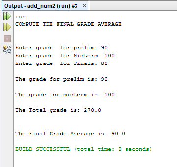
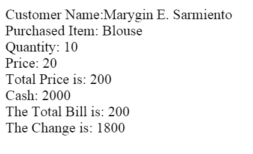
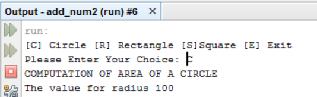

# Lesson 4

Control Structures (Sequence/Selection Structure)

Usage of `if`, `if else`, `else if`, and `switch case`

## Activities

### Activity 1: Sequence Structure

#### Average Grade Calculator

Create  a program that will compute the average of your final grade. The user will input value for prelim, midterm and finals. Compute the total and its average. Display the following output:

[Source Code](/src/lesson4/Sequence1.java)

### Activity 2: If Statement

#### Grade Remarks

Create a program that will input grade and will display the corresponding equivalent. Use if statement in a program.
| GRADE | EQUIVALENT |
|-------|------------|
|A   |EXCELLENT      |
|B   |VERY GOOD      |
|C   |GOOD           |
|D   |FAIR           |
|E   |POOR           |
|F   |NEEDS IMPROVEMENT   |

[Source Code](/src/lesson4/If1.java)

### Activity 3: If Else

#### Password Checker

Create a program that will input a password and will determine if the password is correct, display the message, `Password is granted` otherwise `Password is denied`. Use your name as your password. The password should be written in uppercase letters.

[Source Code](/src/lesson4/IfElse1.java)

#### Odd or Even

Create another program that will input a number and will determine if it is odd or even number. Use if else statement in the program.

[Source Code](/src/lesson4/IfElse2.java)

#### Order Details

Create a program that will input customer’s name, purchased item, quantity, price and cash. Compute the Total Bill and the change of the customer. If the customer reaches the total bill which is greater than or equal to 1000 pesos, he or she gets 30% discount of his/her total bill. Use if else statement.

[Source Code](/src/lesson4/IfElse3.java)

### Activity 4: Else if

#### Grade Equivalent Calculator

Create a program that will input a grade and will display its corresponding equivalent based on the given below. Use logical operator and else if statement in the program.

| Grades  | Equivalent  |
|---|---|
| 99 - 100  | 1.00  |
| 96 - 98  | 1.25  |
| 93 - 95  | 1.50  |
| 90 - 92  | 1.75  |
| 87 - 89  | 2.00  |
| 84 – 86  | 2.25  |
| 81 – 83  | 2.50  |
| 77 – 80  | 2.75  |
| 75 - 76  | 3.00  |
| Below 75  | 5.00  |

[Source Code](/src/lesson4/ElseIf1.java)

### Activity 5: Switch Case

#### Shape Area Calculator

Create a program that will compute the area of a circle, area of rectangle and area of square. Assign any values for radius, length, width and side for the square. Display the following output:

[Source Code](/src/lesson4/Switch1.java)
