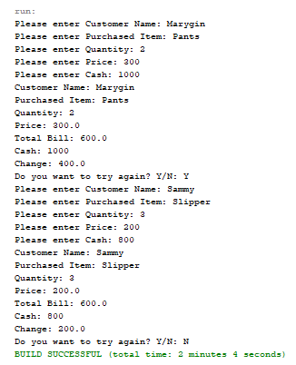
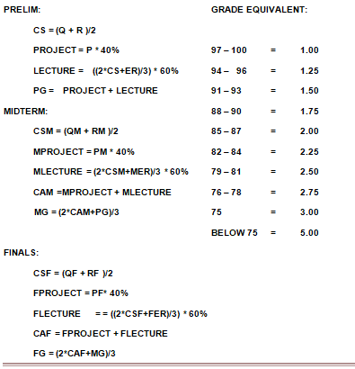

# Lesson 4

All about Retition Structure.
- Do While loop
- While loop
- For loop

## Assignment

This program will describe the use of repetition structure. The user will input name and it will display on the screen 10 times. The code given is using a `do while` loop.
[Source Code](/src/lesson5/Nametentimes.java)

## Activity 1

Modify the program in your assignment and convert it to the remaining types of repetition structures such as `while` loop and `for` loop statement. It displays the same output but it is written in different ways, applying the syntax for every repetition statement.
[`while` loop](/src/lesson5/WhileLoop.java)
[`for` loop](/src/lesson5/ForLoop.java)

## Activity 2

Create a program that will display the multiplication table. Use any repetition structure. Display 10 numbers in horizontal and vertical format.
[Source Code](/src/lesson5/MultiplicationTable.java)

## Activity 3

Use `Do While` loop.
Create a program that will compute the total bill of the customer. The program will input item purchased, quantity, price and cash given by the customer. It will display automatically the total bill and the change of the customer If the cash is greater than the total bill. If the customer reaches 1000 pesos, he will avail 30% discount of his total bill. Use `if else` statement and repetition structure to display the `Do you want to try again Y/N?`.

[Source Code](/src/lesson5/BillCalculator.java)

## Activity 4

Create a program that will compute the prelim, midterm, final grades of the students. The program will input grades for quiz, recitation, project, and exam rating. The class standing, class average and the prelim, midterm and final grades will be computed and displayed automatically. Display also the grade equivalent and if the grade of the student is greater than 75 then the remark will be `passed` otherwise `failed`. Use *any* selection and repetition structures. Use these formulas:

[Source Code]()