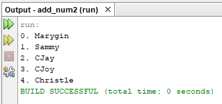
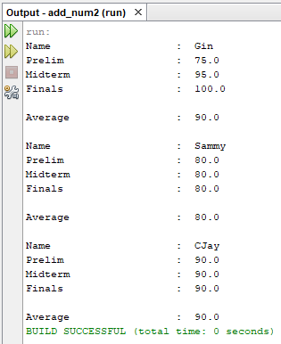

# Lesson 6

All about Arrays.

## Notes

It can hold different data in just one variable.
List of the same type.
Length is fixed after creation.
**Element** - Each item in an array.
**subscript** - inside square brackets; indicates one of an array’s variable.

### Initializing an Array

Array declaration: `int myArray[]`
Array instantiation: `myArray = new int[10]`
`new elementType[arraySize]`

### Accessing an Array

Similar to C.
`anArray[i] = value;`

---

## Activity 1

Create a simple array program that will display different names and store in one variable. Display the different names. Display the following output as shown below.

[Source Code](/src/lesson6/NameArray.java)

## Activity 2

Create another program that will store three student names with corresponding grades for prelim, midterm and finals. Compute its average. Display the following output as shown below.

[Source Code](/src/lesson5/Students.java)
